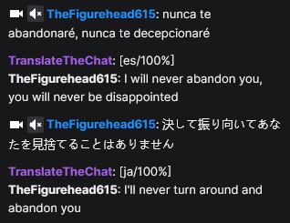

# Twitch automatic chat translator
Python script that reads incoming Twitch chat messages and attempts to translate them in realtime. 
The script sends incoming messages automatically to Google Translate which detects the language and translates it into English

## Installation
1. Download `TwitchTranslator.exe` and `settings.json` from https://github.com/jespk77/twitchaio/releases/
2. Follow https://github.com/jespk77/twitchaio?tab=readme-ov-file#getting-started to set up your Twitch developer application: the `client.json` file needs to be put in the same folder as the translator
3. Open `settings.json` and fill in the required parameters:
   - `blacklist_file`: [optional] the list of words to blacklist, if any of these words appear in the translated sentence they will be replaced with ***. If provided, should be a text file with one word (or combination of words) per line, not case-sensitive.\
   NOTE: this file is only read on startup, if the content changes the program must be restarted for them to take effect
   - `ignored_users`: [optional] the list of users to ignore, messages from these users will not be translated, not case-sensitive
   - `ignored_words_file`: [optional] the list of words to ignore, if a message contains any of these words they will be removed before translation. If provided, should be a text file with one word (or combination of words) per line, not case-sensitive\
   NOTE: this file is only read on startup, if the content changes the program must be restarted for them to take effect
   - `translation`:
     - `minimal_confidence`: [optional] the minimum confidence % for a message to be posted to chat, used to filter out bad translations
     - `target_language_code`: [required] the target language code for translation, see https://py-googletrans.readthedocs.io/en/latest/#googletrans-languages for a list of supported languages and the corresponding code\
   - `twitch`:
     - `authentication_file`: [required] this file stores the credentials for the translation bot, will be created and filled on first run\
     - `join_channels`: [required] the channels to join and translate incoming messages\
     - `username`: [required] username of the account that will respond with translated messages
4. Start the program
